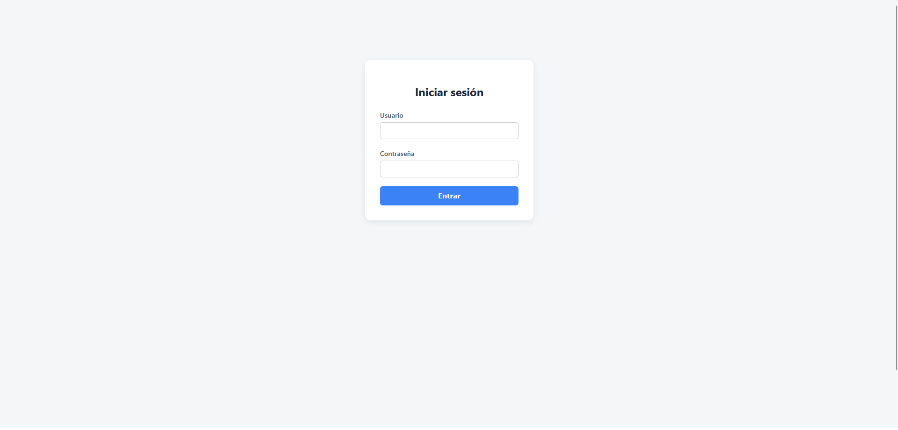
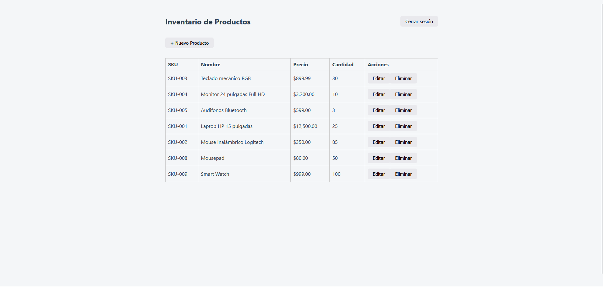
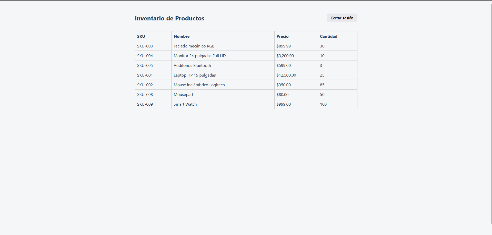
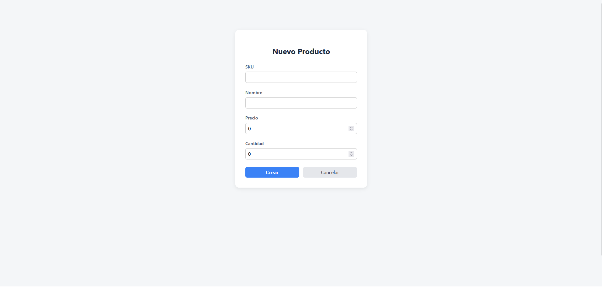
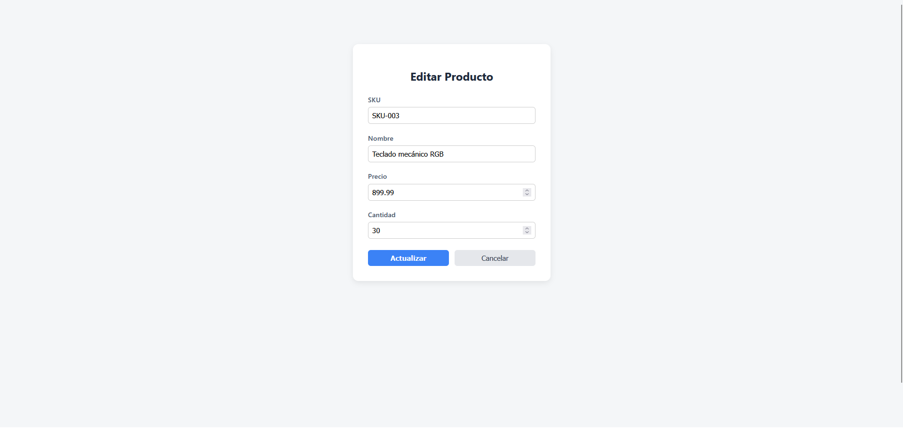

# Sistema de Gestión de Inventario

Aplicación web para la administración de inventario de una tienda, desarrollada como prueba técnica. Permite gestionar productos (crear, consultar, actualizar, eliminar) con persistencia en una base de datos relacional y control de acceso basado en roles.

**Repositorio:** https://github.com/AgAsHer/inventario

## Tecnologías utilizadas

**Backend**
- Java 17 + Spring Boot 4
- Spring Data JPA (Hibernate)
- Spring Security + JWT (io.jsonwebtoken / JJWT)
- PostgreSQL
- Maven

**Frontend**
- Angular 22 (standalone components)
- TypeScript
- RxJS

## Estructura del repositorio

El repositorio contiene el backend y el frontend, cada uno con su propio gestor de dependencias.

```
inventario/
├── backend/          # API REST en Spring Boot
├── frontend/         # Aplicación de página única (SPA) en Angular
└── README.md
```

## Decisiones de arquitectura

### Alcance del proyecto
El documento de la prueba especifica un conjunto de requisitos mínimos viables (CRUD de productos con persistencia en PostgreSQL) y un bloque de "Deseables" (autenticación JWT, RBAC, CORS, Git Flow, despliegue con dominio público, microservicios, procedimientos almacenados). Se implementó la gran mayoría de estos.

### Backend en capas (Controller → Service → Repository)
Se optó por una arquitectura monolítica con separación de responsabilidades:

- **Controller**: recibe peticiones HTTP y las valida, sin lógica de negocio.
- **Service**: contiene la lógica de negocio (validación de SKU único, control de stock).
- **Repository**: acceso a datos vía Spring Data JPA.

### Patrón DTO
Las Entities (mapeo directo a las tablas) nunca se exponen directamente en la API. Se usan DTOs para controlar qué datos entran y salen: por ejemplo, el cliente nunca puede establecer el `id` ni las fechas de auditoría de un producto, ya que esos campos no existen en `ProductDTO` en el payload de entrada.

### Procedimientos almacenados (PL/pgSQL)
Dos funciones viven en la base de datos y no en el backend:
- `validar_sku_unico(sku)`: valida unicidad antes de insertar.
- `actualizar_stock(id, delta)`: actualiza la cantidad y rechaza operaciones que dejarían el stock en negativo.

Esto se combina con validaciones en el DTO (formato) y el Service (reglas de negocio), aplicando el principio de **defensa en profundidad**: cada capa protege contra escenarios que las otras no pueden ver.

### Tipos de datos para dinero
El campo `precio` usa `NUMERIC(10,2)` en PostgreSQL y `BigDecimal` en Java, no usa `FLOAT`/`DOUBLE`, para evitar errores de redondeo en cálculos monetarios.

### Autenticación JWT (no OAuth2)
Se eligió JWT propio sobre OAuth2 porque no requiere dependencias externas (registro en un proveedor), y permite demostrar el manejo completo del ciclo de autenticación: hashing de contraseñas (BCrypt), generación/validación de tokens, y protección de rutas por rol.

### Usuarios de prueba
Se incluyeron dos usuarios con roles diferenciados, uno tipo "Admin" con acceso a la creación, edición y eliminación de productos y otro tipo "Lector" que solo puede consultarlos. Los usuarios de prueba se cargan vía `seed.sql` con contraseñas ya hasheadas.

## Requisitos previos

- Java 17 o superior
- Maven (o usar el wrapper incluido, `mvnw`)
- Node.js 18+ y npm
- Angular CLI (`npm install -g @angular/cli`)
- PostgreSQL 14+ instalado y corriendo localmente

## Instalación y ejecución

### 1. Clonar el repositorio

```bash
git clone https://github.com/AgAsHer/inventario.git
cd inventario
```

### 2. Configurar la base de datos

Crea una base de datos en PostgreSQL llamada exactamente **`Tienda`**:

```sql
CREATE DATABASE "Tienda";
```

Luego ejecuta los scripts en orden:

```bash
psql -U postgres -d Tienda -f database/schema.sql
psql -U postgres -d Tienda -f database/seed.sql
```

### 3. Configurar y levantar el backend

Si tu usuario/contraseña de PostgreSQL son distintos a los configurados por defecto, edita `backend/src/main/resources/application.properties`:

```properties
spring.datasource.username=tu_usuario
spring.datasource.password=tu_password
```

(La URL de conexión y el nombre de la base ya vienen configurados para `Tienda`, no es necesario modificarlos si se siguió el paso anterior.)

Levanta el backend:

```bash
cd backend
./mvnw spring-boot:run
```

El backend queda disponible en `http://localhost:8080`.

### 4. Configurar y levantar el frontend

```bash
cd frontend
npm install
ng serve
```

El frontend queda disponible en `http://localhost:4200`.

## Usuarios de prueba

| Usuario  | Contraseña  | Rol    | Permisos                              |
|----------|-------------|--------|---------------------------------------|
| `admin`  | `admin123`  | ADMIN  | Acceso total (GET, POST, PUT, DELETE) |
| `lector` | `lector123` | LECTOR | Solo lectura (GET)                    |

Estos usuarios se cargan automáticamente al ejecutar `seed.sql`.

## Endpoints de la API

Todos los endpoints están bajo el prefijo `/api/v1`.

### Autenticación

| Método | Endpoint      | Descripción                     | Acceso  |
|--------|---------------|---------------------------------|---------|
| POST   | `/auth/login` | Inicia sesión y devuelve un JWT | Público |

**Request:**
```json
{
  "username": "admin",
  "password": "admin123"
}
```

**Response:**
```json
{
  "token": "eyJhbGc...",
  "username": "admin",
  "role": "ADMIN"
}
```

### Productos

| Método | Endpoint         | Descripción               | Acceso                      |
|--------|------------------|---------------------------|-----------------------------|
| GET    | `/products`      | Lista todos los productos | Autenticado (cualquier rol) |
| GET    | `/products/{id}` | Detalle de un producto    | Autenticado (cualquier rol) |
| POST   | `/products`      | Crea un producto          | Solo ADMIN                  |
| PUT    | `/products/{id}` | Actualiza un producto     | Solo ADMIN                  |
| DELETE | `/products/{id}` | Elimina un producto       | Solo ADMIN                  |

Las rutas protegidas requieren el header:

Authorization: Bearer <token>

**Request de ejemplo (POST /products):**
```json
{
  "sku": "SKU-010",
  "nombre": "Producto de ejemplo",
  "precio": 199.99,
  "cantidad": 15
}
```

## Funcionalidades deseables implementadas

El enunciado de la prueba establece que el CRUD básico de productos es el mínimo viable, y presenta un conjunto de funcionalidades "deseables" para valorar. Las siguientes fueron implementadas en su totalidad:

- **Autenticación JWT + RBAC**: login propio con tokens firmados, y dos roles (`ADMIN`, `LECTOR`) con permisos diferenciados tanto en el backend (protección de rutas por rol) como en el frontend (ocultamiento de controles de edición/eliminación para el rol LECTOR).
- **Validación de CORS**: configurado explícitamente en el backend para aceptar únicamente peticiones desde el origen del frontend.
- **Git Flow**: desarrollo sobre la rama `develop`, con `main` reservada para versiones estables, y mensajes de commit siguiendo la convención de Conventional Commits (`feat:`, `fix:`, `docs:`, `refactor:`, `style:`).
- **Procedimientos almacenados (PL/pgSQL)**: `validar_sku_unico` y `actualizar_stock`, descritos en la sección de decisiones de arquitectura.
- **Separación de responsabilidades**: arquitectura en capas bien delimitadas (ver sección de arquitectura), en lugar de microservicios reales — decisión justificada por el alcance del proyecto.
- **Manejo centralizado de errores**: un `GlobalExceptionHandler` traduce cada tipo de excepción a una respuesta HTTP semánticamente correcta (404, 409, 400, 401), en un formato JSON consistente.
- **Datos de prueba (`seed.sql`)**: productos y usuarios de ejemplo, para que la evaluación pueda hacerse de inmediato sin necesidad de crear datos manualmente.

## Capturas de pantalla

### Login


### Listado de productos (rol ADMIN)


### Listado de productos (rol LECTOR)


### Formulario de creación/edición

